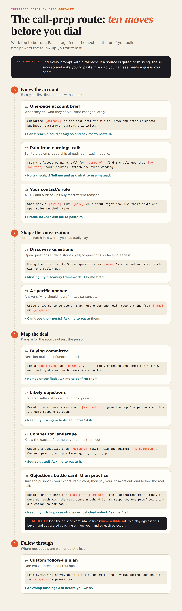

# Sales Call Preparation and Research

**Give it a company name. Get a sourced, citation-tagged PDF brief ready for the call.**


`sales-call-prep` is a [Hermes Agent](https://hermes-agent.nousresearch.com/docs) skill that runs the ten-stage *call-prep route* end to end: it researches the account, pulls pain points from earnings calls, maps the buying committee, and renders the whole thing as a formatted PDF brief — account brief, discovery questions, a specific two-sentence opener, likely objections, competitor landscape, a five-objection battle card, and a follow-up plan.

**No invented facts.** Every claim in the brief is tagged `sourced` (with a citation) or `inferred` (reasoning, labeled as such). Anything that cannot be verified becomes an explicit gap with an ask the rep can act on ("paste her last 3 posts") — never a plausible-sounding guess. The skill never bypasses logins or paywalls. Here is the process the agent will run through, prompt by prompt automatically, saving your sales team significant research and prep time.

## What you get

A multi-page PDF with a call-day snapshot on page one, then all ten stages:

1. One-page account brief
2. Pain points from earnings calls, with short exact quotes
3. Your contact's role
4. Five open discovery questions with follow-ups
5. A two-sentence opener anchored on something real and recent
6. Buying committee
7. Top three likely objections
8. Competitor landscape
9. A five-objection battle card (real concern, response, proof point, question back)
10. A follow-up email and three value-adding touches

The last page lists every gap (anything gated, missing or unverifiable) with exactly what to paste
so the stage can be re-run. Each claim is tagged SOURCED or INFERRED and cites numbered sources.

## The Process



Plus a **call-day snapshot** written last and shown first: the 3–5 takeaways most likely to change how the call goes.

## Install

### Option A: Hermes skills tap (recommended)

```bash
hermes skills tap add ericgonzalez/HermesAgent-Callprep
hermes skills search "sales call prep"   # find the identifier
hermes skills install <identifier>
```

### Option B: manual

```bash
git clone https://github.com/ericgonzalez/HermesAgent-Callprep /tmp/callprep
cp -R /tmp/callprep/skills/sales-call-prep ~/.hermes/skills/
pip install reportlab
```

**Requirements:** Python 3 and `reportlab` (used only to render the PDF). No network calls from the script itself.

## First run

Say, for example:

> Prep me for a call with Acme Corp.

The skill asks **one batched question** to fill in `references/seller-profile.md` (your company, solution, approved proof points, pricing rules, discovery framework) and offers to save the answers so every future brief reads them. Until then, solution-fit content is tagged `inferred` and proof points say "Needs rep input".

## How to use it

- `/sales-call-prep Acme Corp` — or just a bare company name in a sales context
- "Research Acme for a sales call", "brief me on Acme", "build a battle card for Acme"

Output lands in `~/call-prep/<company-slug>/`:

```
~/call-prep/acme-corp/
├── payload.json                     # machine-readable brief, all sections
└── acme-corp-call-prep-2026-09-30.pdf
```

The reply highlights the three findings most likely to change the call, the gaps that need your input, and states that the follow-up email is a **draft** — nothing is ever sent automatically.

## Repository layout (skill tap)

```
├── README.md
├── LICENSE
└── skills/
    └── sales-call-prep/
        ├── SKILL.md                  # the skill (frontmatter + procedure)
        ├── references/
        │   ├── prompts.md            # the ten stages: prompts, fallbacks, "done" criteria
        │   └── seller-profile.md     # YOUR profile — fill in on first run
        ├── scripts/
        │   └── build_brief_pdf.py    # JSON payload → formatted PDF (validate + build)
        ├── assets/
        │   └── sample_payload.json   # complete fictional payload, exact schema shape
        ├── sales-call-prep-flowchart.png
        └── sample-call-prep-brief.pdf
```

This repo is a [Hermes skill tap](https://hermes-agent.nousresearch.com/docs/user-guide/features/skills#publishing-a-custom-skill-tap): add it with `hermes skills tap add ericgonzalez/HermesAgent-Callprep` and install any skill under `skills/` — more skills can be added to this repo over time.

## Design principles

- **Stop rule:** gated or missing source → recorded in `gaps[]` with a concrete ask. Never guessed, never paywalled.
- **Sourced vs inferred:** every claim carries a tag; inference is never dressed up as fact.
- **Quotes are short and exact:** at most two sentences verbatim, with speaker, call, and link — or they're dropped and tagged.
- **No invented proof points:** battle-card proof points come only from the seller profile or cited sources.

## License

Released under the MIT License, see [LICENSE](LICENSE).

Claude Cowork users: use the Hermes version of this skill at https://github.com/ericgonzalez/Claude-Callprep
